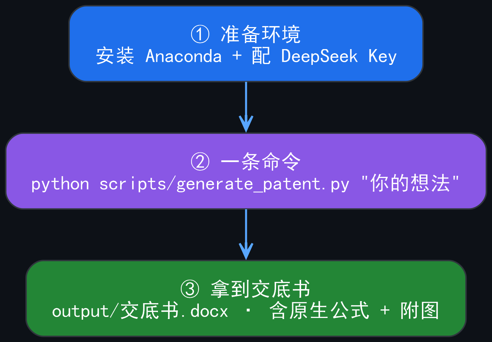
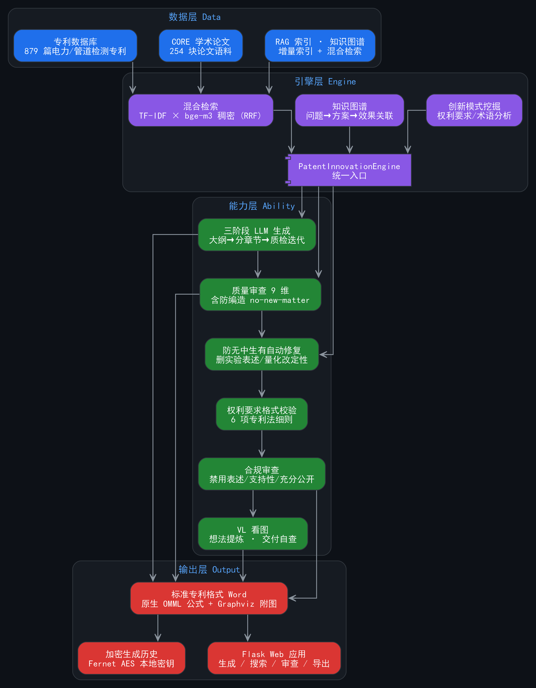

<div align="center">

# 📜 专利撰写助手

**电力行业 · 管道检测机器人方向的 AI 专利撰写系统**

把脑子里的技术想法，一键变成**标准专利格式的 Word 交底书**。

> 不需要懂专利格式，不需要会写交底书——说出你的想法，剩下的交给它。

</div>

---

## ✨ 一句话认识它

这是一个面向 **电力行业 + 管道检测机器人** 方向的 AI 专利撰写工具。

核心能力只有一句话：

> **从技术想法，到可直接提交的标准专利格式 Word 交底书**（不是从交底书到专利）。

它有三件法宝：

| | 法宝 | 说明 |
|---|------|------|
| 🧠 | **三阶段 AI 生成** | 大纲 → 分章节撰写 → 质检迭代，全程自动；Web 端实时显示生成阶段进度 |
| 🛡️ | **防无中生有** | 自动识别并修复 AI 编造的数据 / 专利号 / 实验结论 |
| 📦 | **标准格式导出** | 原生可编辑公式（OMML）+ 自动专利风格附图 + 权利要求格式校验 |

<div align="center">

</div>

---

## ⚡ 一键启动（零门槛，推荐）

> 不需要命令行、不需要懂 Python——**双击一个文件就能用**。

1. **双击**项目根目录下的 `启动专利撰写助手.bat`
2. 脚本会自动完成：检查 Python 环境 → 检查/创建 API 配置 → 检查依赖 → 启动服务
3. 服务就绪后**自动打开浏览器**进入操作界面（http://localhost:5000）
4. 用完**关闭黑色窗口**即停止服务

> 💡 首次运行会引导你填写 API Key（自动打开配置文件）；首次启动引擎初始化约 1-2 分钟，之后每次启动约 1 分钟。
>
> 💡 脚本还会自动检查依赖，缺失时自动安装 requirements.txt，无需手动操作。

## 🚀 手动模式（进阶，5 分钟快速开始）

> 面向**零编程经验**的新手，全程复制粘贴命令即可。一键启动不可用时（如无 PowerShell 环境）可走此流程。

### 第 1 步：装好 Python 环境（一次即可）

1. 安装 [Anaconda](https://www.anaconda.com/download)（一路 Next 即可）
2. 打开 **Anaconda Prompt**，依次执行：

```bash
conda create -n patent python=3.10 -y
conda activate patent
cd 项目所在目录
pip install -r requirements.txt
```

### 第 2 步：配置 AI 密钥（一次即可）

1. 打开 [DeepSeek 开放平台](https://platform.deepseek.com) → 注册 → **API Keys** → 创建一个 `sk-` 开头的 Key
2. 复制配置文件并填入你的 Key：

```bash
copy config\api_config.example.json config\api_config.json
```

3. 用记事本打开 `config\api_config.json`，找到：

```json
"api_key": "你的DeepSeek API Key"
```

把它替换成你的 `sk-...`，保存。

> ⚠️ 这个文件含密钥，**千万不要**提交到 GitHub / 发给别人。

### 第 3 步：生成第一份交底书

```bash
python scripts/generate_patent.py "一种基于深度学习的管道缺陷检测机器人" --out output/交底书.docx
```

等 1-3 分钟（首次会先初始化数据库约 1 分钟），就能在 `output/交底书.docx` 拿到标准专利格式的 Word 文件。

> 也可以把 **手绘草图 / 系统框图 / 论文截图** 直接贴给 AI，它会看图提炼技术字段（见下文"贴图输入"）。

---

## 🗺️ 一次看懂：想法是怎么变成交底书的

<div align="center">

</div>

| 步骤 | 做什么 | 为什么需要 |
|------|--------|-----------|
| ① 技术想法 | 你的一句话想法，或一张图 | 起点 |
| ② 三阶段 LLM 生成 | 大纲规划 → 分章节撰写 → 8 维质检迭代（<70 分自动重写） | 保证全文 1.2-1.9 万字、平均 96 分 |
| ③ 防无中生有 | 删实验表述 / 量化改定性 / 删编造专利号 | 避免 AI"编数据"被审查员驳回 |
| ④ 权利要求校验 | 编号 / 引用 / 特征段 6 项自动检查 | 符合专利法细则 |
| ⑤ 合规审查 | 禁用表述 / 引用关系 / 充分公开 | 降低被驳回风险 |
| ⑥ 加密保存历史 | 每份交底书加密存档 | 密钥本地管理，随时回溯 |
| ⑦ 导出标准 Word | 原生公式 + Graphviz 自动附图 | 可直接编辑提交 |
| ⑧ 交付自查（可选） | 把 Word 渲染成图，AI 回看显示质量 | 避免"导出成功但渲染有问题" |

---

## 🧩 功能亮点

| 能力 | 说明 |
|------|------|
| 🚀 **一键生成流水线** | 想法 → 标准专利格式 Word，全自动 |
| 📝 **标准专利格式** | 发明名称 → 摘要 → 权利要求书 → 说明书五段式 |
| 🧮 **原生可编辑公式** | LaTeX → Word 原生 OMML 公式（无需 MathType，可直接编辑） |
| 🖼️ **自动附图** | Mermaid 流程图 → Graphviz 引擎自动布局（300dpi）→ 专利风格框图 |
| 👁️ **贴图输入** | 手绘草图 / 框图 / 截图 → VL 看图提炼技术字段（`qwen-vl`） |
| 🛡️ **防无中生有** | 自动修复 AI 编造的数据、专利号、实验结论 |
| ⚖️ **权利要求校验** | 编号 / 完整性 / 引用 / 特征段 / 存在性 / 顺序 6 项 |
| 🔒 **合规审查** | 禁用表述 / 摘要字数 / 引用关系 / 支持性 / 充分公开 |
| 🔐 **历史加密存储** | 交底书 Fernet AES 加密，密钥本地管理；Web 端可查看 / 下载 / 删除 |
| 🔍 **学术论文进库** | 自动检索 CORE 学术论文，与专利一起参与检索（技术调研升级） |
| 📋 **交付自查** | Word 渲染成图后 AI 回看公式 / 附图 / 布局 / 乱码 |
| 🏗️ **知识图谱** | 问题→方案→效果→技术→设备 多维关联 |
| 🔎 **混合检索** | TF-IDF + bge-m3 稠密向量 RRF 融合 |
| 🌐 **Web 应用** | Flask 单页界面，生成 / 搜索 / 审查 / 历史 / 导出；未配置 Key 时自动引导 |

---

## 🏗️ 系统架构

<div align="center">

</div>

| 层 | 内容 |
|----|------|
| **数据层** | 自建专利数据库（879 篇电力/管道检测专利）+ CORE 学术论文 + RAG 索引 / 知识图谱 |
| **引擎层** | `PatentInnovationEngine` 统一入口：混合检索、知识图谱、创新模式挖掘 |
| **能力层** | 三阶段生成、质量审查、防编造、权利要求校验、合规审查、VL 看图 |
| **输出层** | 标准 Word 导出、加密历史、Web 应用 |

> 对外只需使用统一入口：`from src.core import PatentInnovationEngine`。

---

## ⚙️ 常用命令

### 🚀 生成

```bash
# 一键生成交底书（核心入口）
python scripts/generate_patent.py "技术想法" \
    --title "一种..." --tech-field "技术领域" \
    --purpose "要解决的问题" --core-method "核心方法" \
    --problems "现有技术不足" --out output/交底书.docx

# 生成后自动渲染回看显示质量（需 LibreOffice）
python scripts/generate_patent.py "技术想法" --selfcheck

# 对已有 Word 单独做交付自查
python scripts/selfcheck_disclosure.py output/交底书.docx
```

### 🧪 测试

```bash
python scripts/run_tests.py          # 自动化测试（22+ 项，真实调 LLM，约 10-15 分钟）
```

### 📚 数据（扩充专利/论文库）

```bash
python scripts/paper_discover.py --db        # 检索 CORE 学术论文进知识库并重建 RAG
python scripts/ipc_discovery.py 3            # IPC 领域专利发现
python scripts/fast_crawl.py                 # 并发爬取专利全文
python scripts/firecrawl_discover.py --query "管道检测 专利"  # Firecrawl 备用通道
python scripts/db_maintain.py --dry-run      # 数据库治理（先分析不写回）
```

### 👁️ 贴图输入

```bash
# 把一张或多张图（草图/框图/截图）提炼成技术字段
python -m src.utils.idea_vision 图1.png 图2.png
```

> 更多脚本见 [scripts/README.md](scripts/README.md)。

---

## 💻 进阶使用

### 代码调用

```python
from src.core import PatentInnovationEngine

engine = PatentInnovationEngine()
engine.initialize()

# 生成技术交底书（三阶段 + 自动质检迭代 + 防编造 + 校验 + 合规）
result = engine.generate_disclosure(
    "一种配电网故障自愈控制方法",
    fields={"tech_field": "电力系统", "purpose": "...", "core_method": "..."}
)
print(result["disclosure"])      # 交底书全文
print(result["mode"])            # llm_staged / llm_single / template
print(result["quality_report"])  # 质检报告
print(result["compliance_report"])  # 合规审查报告

# 综合查询（专利 + 学术论文分开返回）
engine.query("管道缺陷检测")

# 其他能力
engine.suggest_innovation("虚拟电厂调频")  # 创新方向建议
engine.review_quality(disclosure, idea)    # 独立质量审查
```

### Claude Code Skills

项目内置 6 个 Skills，在 Claude Code 中按需调用：

| Skill | 阶段 | 用途 |
|-------|------|------|
| `/idea-to-disclosure` | 想法→交底书 | **核心流程**：想法一键生成标准交底书 |
| `/patent-writer` | 交底书→专利 | 撰写权利要求书 + 说明书 + 摘要 |
| `/compliance-checker` | 交底书→专利 | 专利文件合规性检查 |
| `/patent-supervisor` | 交底书→专利 | 撰写质量监督（方向守护 / 防编造） |
| `/patent-orchestrator` | 交底书→专利 | 编排多角色完成撰写流程 |
| `/patent-fetcher` | 数据支撑 | 获取专利全文填充参考库 |

> 核心目标是**想法→交底书**。"交底书→专利"的 skills 作为第二阶段保留。

### Web 应用

```bash
python app.py
```

浏览器访问 **http://localhost:5000**（无需代理，本地功能都能用）。

---

## 📦 项目结构（精简版）

```
专利撰写助手/
├── app.py                    # Flask Web 应用（端口 5000）
├── CLAUDE.md                 # 项目协作约定
├── config/                   # 配置（API 密钥 / 术语库 / 专利法 / 效果模板）
├── data/
│   ├── patent_database/      # 专利数据库（879 篇，核心数据）
│   ├── knowledge_base/       # 论文 / 报告（含 papers_index.json）
│   ├── rag_index/            # RAG 检索索引
│   ├── knowledge_graph/      # 知识图谱
│   └── disclosure_history/   # 交底书加密历史（不入库）
├── src/
│   ├── core/                 # 分析引擎（生成/质检/合规/RAG/图谱…）
│   ├── api/                  # 数据源接口（Google Patents/CORE/VL/Firecrawl）
│   ├── parsers/              # 文本解析器
│   └── utils/                # 工具（Word导出/绘图/自查/加密）
├── scripts/                  # 运行脚本（生成/测试/爬取/自查）
├── templates/                # 前端页面 + 撰写模板
├── .claude/skills/           # Claude Code Skills
├── docs/                     # 项目文档（architecture / modules / images）
└── output/                   # 生成结果
```

---

## 🌐 爬取专利数据（可选功能）

**生成交底书、Web 应用、搜索本地库都不需要代理**。只有扩充专利库需要。

### Clash 代理

国内访问 Google Patents 需要代理：

1. 安装 Clash 客户端（Clash Verge / Clash for Windows），导入订阅
2. 开启系统代理
3. 验证：浏览器能打开 [patents.google.com](https://patents.google.com) 即通

```bash
python scripts/ipc_discovery.py 3   # 发现新专利（按 IPC 分类号）
python scripts/fast_crawl.py        # 并发爬取全文
```

> 爬一会儿报 503 = 当前节点 IP 被 Google 封了，在 Clash 里换个节点即可。

### CORE 学术论文（无需代理）

电力 / 管道检测方向的学术论文检索，**不需要代理**：

```bash
# 检索论文进知识库并并入 RAG 检索（--db 会重建索引，首次约 10-25 分钟）
python scripts/paper_discover.py --db

# 只搜索不落盘，先看看连通性
python scripts/paper_discover.py --dry-run
```

---

## 🔧 配置说明

密钥全部集中在 `config/api_config.json`（**不入库**，从 `api_config.example.json` 复制创建）：

| 配置段 | 用途 | 必须 |
|--------|------|------|
| `llm` | DeepSeek，生成交底书的 AI 引擎 | ✅ |
| `embedding` | 硅基流动 bge-m3 稠密向量（可选，配置后升级混合检索） | 可选 |
| `google_patents` | 专利爬取代理 | 可选 |
| `firecrawl` | 备用爬取通道 | 可选 |
| `dashscope` | qwen-vl 看图 / 交付自查 | 可选 |
| `core` | CORE 学术论文检索 | 可选 |

> 未配置 embedding / dashscope / core 时功能自动降级，不影响主流程。

---

## ❓ 常见问题（FAQ）

**Q：一定要懂专利格式吗？**
不用。系统内置标准专利格式模板，你只需要描述技术想法。

**Q：生成一份要多长时间？**
首次初始化约 1 分钟，之后一次生成约 1-3 分钟（全文 1.2-1.9 万字）。

**Q：AI 会不会瞎编数据？**
系统内置"防无中生有"检查，自动删除实验表述、量化改定性、删编造专利号。但这不代表 AI 生成的内容可以不经核对直接提交——**建议人工复核关键数据**。

**Q：DeepSeek Key 怎么拿？**
[platform.deepseek.com](https://platform.deepseek.com) 注册 → API Keys → 创建。

**Q：为什么爬专利要代理？**
Google Patents 在国内被墙。不爬数据就不需要代理。

**Q：专利详情里的 PDF 原文打不开？**
PDF 查看依赖 pdf.js（在线 CDN）。断网 / 内网环境下会自动隐藏 PDF 标签，文本（权利要求 + 说明书）查看不受影响。

**Q：`output/交底书.docx` 打不开 / 公式乱？**
公式是 Word 原生 OMML（无需插件）。如果用 WPS 老版本打开可能有兼容问题，建议用 Microsoft Word 或新版 WPS。

**Q：LibreOffice 是干嘛的？**
交付自查（`--selfcheck`）用它把 Word 渲染成图片让 AI 检查。没装就跳过自查，不影响生成。

---

## 📚 文档导航

| 文档 | 内容 |
|------|------|
| [CLAUDE.md](CLAUDE.md) | 项目协作约定（环境 / 命令 / 安全红线） |
| [docs/architecture.md](docs/architecture.md) | 系统分层架构、设计决策 |
| [docs/modules.md](docs/modules.md) | src/ 各模块类与函数说明 |
| [scripts/README.md](scripts/README.md) | 所有脚本用法与参数 |
| [.claude/skills/](.claude/skills/) | 6 个 Claude Code Skills |

## 🛠️ 技术栈

- **Web**: Flask + 原生 JS 单页前端
- **LLM**: DeepSeek（OpenAI 兼容格式），三阶段生成 + 质检迭代
- **视觉**: DashScope qwen-vl（看图提炼 / 交付自查）
- **RAG**: scikit-learn TfidfVectorizer + 硅基流动 bge-m3 稠密向量 + RRF 融合
- **知识图谱**: NetworkX + TF-IDF 相似度
- **绘图**: Graphviz dot（300dpi 自动布局，matplotlib 回退）
- **论文检索**: CORE API v3
- **爬虫**: requests + BeautifulSoup4 + lxml
- **日志**: logging + RotatingFileHandler（5MB 轮转保留 3 份）
